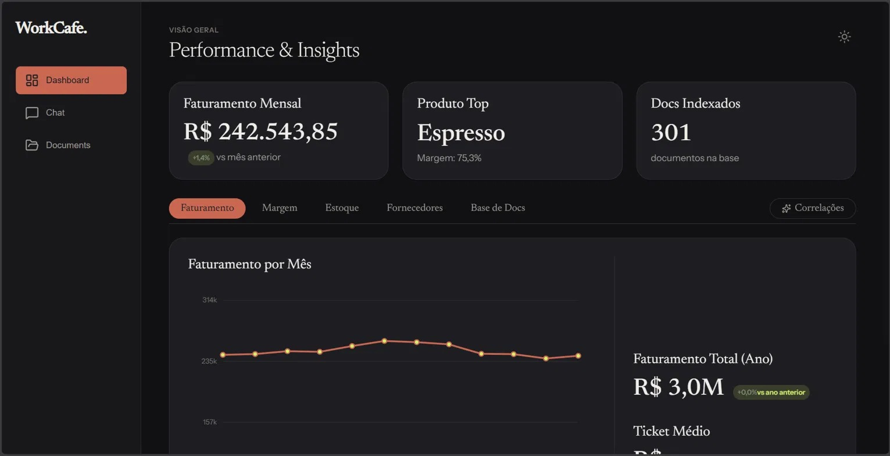
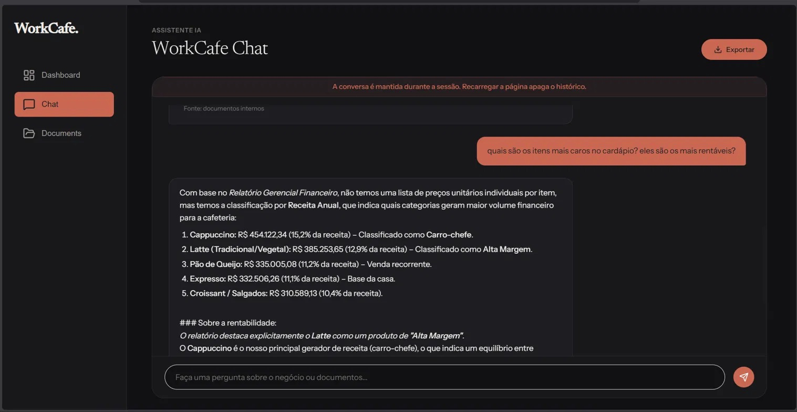
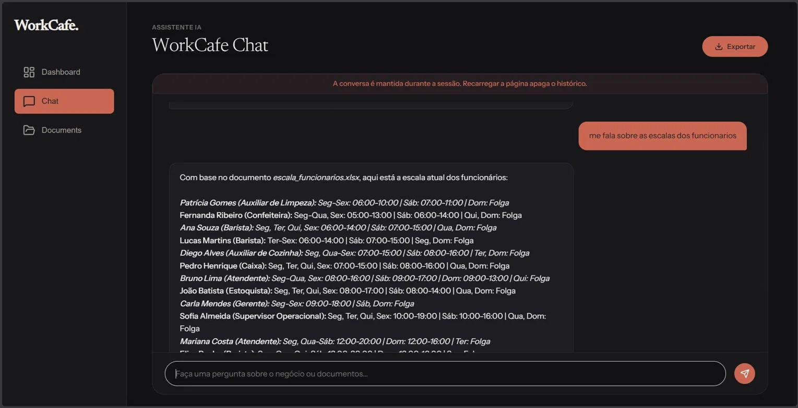
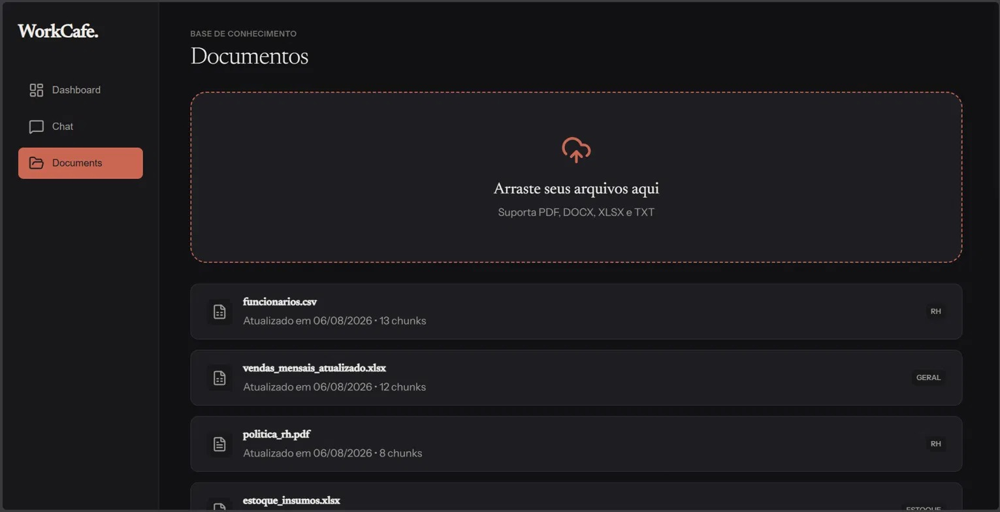
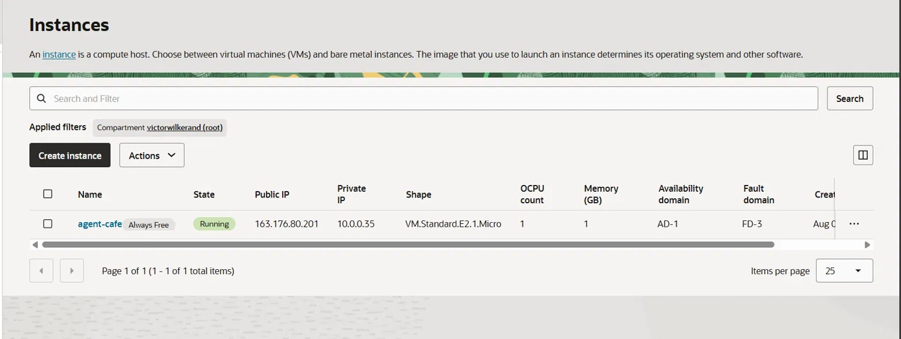
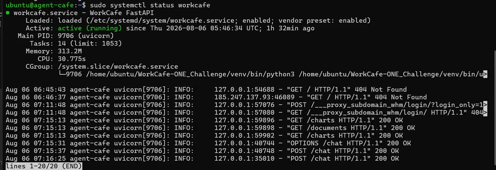

# WorkCafe — Multi-Agent AI System for Document Intelligence

**Challenge:** Oracle Next Education + Alura  
**Stack:** Python · FastAPI · LangChain · LangGraph · ChromaDB · Gemini API · scikit-learn  
**Deploy:** Oracle Cloud Infrastructure (Always Free tier) · Netlify

---
## Screenshots
 
**Dashboard — Performance & Insights**  

 
**Chat — Cross-document analysis (price vs profitability)**

 
**Chat — Employee schedule query**

 
**Documents — Knowledge base with indexed files**  

 
**OCI Console — VM running on Always Free tier**  

 
**Production server — systemd service active with live request logs**  


## Overview

WorkCafe is a multi-agent AI platform that allows cafe collaborators to query internal documents in natural language. The system ingests documents of multiple formats, indexes them in a local vector database, and exposes a conversational agent capable of answering questions, generating dynamic charts, and analyzing cross-dataset correlations, all in real time, without opening any document.

The system was built around a fictional cafe (Café Aroma & Grão) with realistic operational documents: menu, stock, HR, suppliers, financials, and customer reviews.

---

## Architecture

```
┌─────────────────────────────────────────────────────────────┐
│                        Frontend                             │
│         HTML / CSS / Vanilla JS  ·  Netlify CDN             │
│   Dashboard · Chat · Documents  ·  WebSocket client         │
└────────────────────────┬────────────────────────────────────┘
                         │ HTTPS / WSS
┌────────────────────────▼────────────────────────────────────┐
│                      FastAPI (OCI VM)                        │
│         /chat  /upload  /charts  /documents  /ws/charts      │
└────────┬───────────────┬──────────────────┬─────────────────┘
         │               │                  │
┌────────▼──────┐ ┌──────▼──────┐ ┌────────▼──────────┐
│  LangGraph    │ │  Ingest     │ │  Watchdog          │
│  Agent Graph  │ │  Pipeline   │ │  (filesystem)      │
│               │ │             │ │                    │
│  chat node    │ │  prep →     │ │  on_created /      │
│  tools node   │ │  parse →    │ │  on_modified →     │
│  ingest node  │ │  chunk →    │ │  ingest_file()     │
│  charts node  │ │  embed →    │ │  build_charts()    │
│  broadcast    │ │  ChromaDB   │ │  broadcast()       │
│  correlate    │ └──────┬──────┘ └────────────────────┘
└───────────────┘        │
                 ┌───────▼───────┐
                 │   ChromaDB    │
                 │  (local disk) │
                 └───────────────┘
```

### Agent Graph (LangGraph)

The LangGraph orchestrates all agents as a directed state graph with conditional edges. The shared state (`AgentState`) is a `TypedDict` flowing through nodes:

```
[START]
    ↓
[router]  ← reads "task" field, routes conditionally
    ├── task="chat"      → [chat] ⟷ [tools] → [END]
    ├── task="ingest"    → [ingest] → [charts] → [broadcast] → [END]
    └── task="correlate" → [correlate] → [END]
```

**State fields:**

| Field | Type | Description |
|---|---|---|
| `messages` | `list[BaseMessage]` | Conversation history (append-only via `add_messages`) |
| `task` | `str` | Routing key: `chat`, `ingest`, or `correlate` |
| `filepath` | `str \| None` | Path to file being ingested |
| `thread_id` | `str \| None` | Session identifier for memory persistence |
| `dataset_a / b` | `str \| None` | Dataset names for correlation analysis |
| `chunks_indexed` | `int` | Output of ingest node |
| `charts_data` | `dict \| None` | Output of charts node, passed to broadcast |
| `error` | `str \| None` | Short-circuits graph to END on failure |

---

## Execution Flow

### 1. Document Ingestion

**Location:** `parsers/` · `ingestion/ingest.py`

```
Document (PDF / XLSX / CSV)
        ↓
  prep_{type}.py      → normalize, clean, fix types, fix encoding
        ↓
  parse_{type}.py     → standardized Python dict (type, file, content)
        ↓
  ingest.py           → chunk → embed → ChromaDB
```

**Preparation (`prep_`):**  
Each file passes through a type-specific normalization script before any parsing. `prep_csv.py` detects encoding with `chardet`, identifies separator, converts types, and normalizes column names to snake_case. `prep_xlsx.py` does the same for spreadsheets, expands weekday abbreviations, and handles empty sheets. `prep_pdf.py` cleans extracted text, detects repeated headers/footers, and reconstructs sentences broken by incorrect line breaks.

**Parsing (`parse_`):**  
Parsers receive the output from prep scripts in memory (no disk writes) and produce standardized dicts with a consistent structure: `type`, `file`, and format-specific content. This ensures the ingestor is fully agnostic to file origin.

**Chunking:**  
CSV and XLSX rows are converted into text chunks in the format `"column: value | column: value"`. This format preserves row-level semantics and allows the embedding model to capture context per record. PDFs are split by paragraph.

**Embeddings and indexing:**  
Each chunk is converted to a 768-dimension vector by Google's `gemini-embedding-001`. Vectors are stored in ChromaDB alongside metadata: `source` (filename), `category`, `type`, and `updated_at` (indexing date).

**Category inference:**  
When a new document is uploaded, `infer_category()` sends the filename and a content sample to Gemini, which classifies it into one of the known categories: `financeiro`, `rh`, `estoque`, `fornecedores`, `cardapio`, `clientes`, `operacional`. No manual configuration required.

---

### 2. Intent Classifier

**Location:** `agents/intent_classifier.py`

Before any search, the system identifies the most likely category of the user's question using a conventional ML classifier, no LLM involved.

**How it works:**  
133 example questions distributed across 7 categories are embedded with the Gemini embedding model and used to train a `LogisticRegression` from scikit-learn (C=10, max_iter=1000). The trained model is serialized to `intent_model.pkl`.

At inference time, the question is embedded and the model predicts a category with a confidence score. If confidence exceeds 35%, the search is filtered to that category. Below the threshold, the full collection is searched.

**Why embeddings over TF-IDF:**  
The first implementation used TF-IDF + LinearSVC, producing 20–27% confidence with frequent misclassifications. Switching to Gemini embeddings as the feature representation allowed the model to learn semantic associations — "quem trabalha sábado?" is now correctly classified as `rh` with ~56% confidence.

**Note on deployment:** The `.pkl` file is excluded from version control via `.gitignore`. After every `git pull` on the server, the model must be retrained:

```bash
python -c "from agents.intent_classifier import train; train()"
```

---

### 3. Hybrid Search

**Location:** `agents/hybrid_search.py`

Combines two complementary retrieval methods:

**Semantic search (60–85% weight):**  
ChromaDB converts the query to an embedding and retrieves the nearest chunks by cosine similarity. Captures meaning and context even without keyword overlap.

**Lexical TF-IDF search (15–40% weight):**  
A TF-IDF index is built over the filtered category chunks. Captures exact terms like proper names, codes, and specific values.

**Hybrid scoring:**

```python
hybrid_score = semantic_weight * semantic_score + tfidf_weight * tfidf_score
```

Both scores are normalized to [0, 1] before combination. Weights are dynamic per category:

| Category | Semantic | TF-IDF | Rationale |
|---|---|---|---|
| `rh` | 85% | 15% | Names and schedules are more semantic |
| `fornecedores` | 50% | 50% | Proper names benefit from exact match |
| `cardapio`, `estoque` | 65% | 35% | Balanced |
| others | 70% | 30% | Default |

Accents are normalized via `unicodedata` before TF-IDF to avoid treating `"sábado"` and `"sabado"` as distinct terms.

---

### 4. Chat Agent

**Location:** `agents/agent.py` · `agents/tools.py`

The chat agent uses the ReAct (Reasoning + Acting) pattern via `create_react_agent` from LangGraph prebuilt. The LLM reasons about the question, decides whether to search, calls `search_documents`, evaluates the result, and decides whether to search again before answering.

**Tool `search_documents`:**  
Receives the query → calls the intent classifier → runs hybrid search with `top_k=20` → returns formatted chunks with score and source. The tool docstring is written in English and descriptively to maximize correct LLM usage via function calling.

**System prompt constraints:**
- Always search before answering; never respond from memory
- Cite exact numbers when found
- Mention source filename when relevant
- Never invent information
- Shift definitions: morning = before 12:00, afternoon = 12:00–18:00, evening = after 18:00

**Memory:** Compiled with `MemorySaver` as checkpointer. Each session has a unique `thread_id` generated in the frontend. LangGraph persists message history in RAM per `thread_id` — history is lost on server restart (behavior documented in the UI via disclaimer).

**Integration with graph:** The `agent.py` module exposes `build_agent()` for standalone use. Inside the LangGraph pipeline, the chat logic is implemented directly in `chat_node` within `graph.py`, using `bind_tools([search_documents])` on the LLM and a `route_after_chat` conditional edge that loops back through `tool_node` as long as the model returns `tool_calls`.

---

### 5. Charts Agent

**Location:** `agents/chart_agent.py`

Instead of hardcoded file names, the charts agent fetches chunks directly from ChromaDB by category and uses Gemini to interpret the data and produce chart JSON. This makes the system completely agnostic to filenames — any new document indexed in the correct category automatically updates the charts.

**Charts generated:**

| ID | Type | Data source |
|---|---|---|
| `vendas_por_mes` | Line | `financeiro` category |
| `margem_por_produto` | Bar | `cardapio` category |
| `estoque_vs_minimo` | Horizontal bar | `estoque` category |
| `distribuicao_categorias` | Pie | ChromaDB chunk counts per category |
| `rede_fornecedores` | Graph (nodes/edges) | `fornecedores` category (parsed directly, no LLM) |

---

### 6. Correlation Agent

**Location:** `agents/correlate_agent.py`

Receives two dataset display names (e.g. `"Faturamento"` and `"Estoque"`), maps them to internal category keys via `DISPLAY_TO_CATEGORY`, fetches all chunks of each category from ChromaDB directly (no embedding query — full category retrieval), builds a company context from `financeiro`, `operacional`, and `rh` categories (5 chunks each), and sends everything to Gemini with a structured prompt.

**Output format** (enforced via prompt):

```json
{
  "insights": [
    {
      "titulo": "max 6 words",
      "resumo": "one direct sentence with quantitative data, max 15 words",
      "detalhe": "2-3 sentences with context and recommendation"
    }
  ]
}
```

3–4 insights are generated per call, each covering a different cross-dataset correlation. The company context ensures insights are grounded in the actual operational profile, not generic analysis.

---

### 7. Orchestrator and Watchdog

**Location:** `agents/orchestrator.py`

`watchdog` monitors the `docs/` directory using OS-level filesystem events, no polling. When a file is created or modified, `DocsEventHandler` fires the pipeline:

```
file event → ingest_file() → build_charts_data() → broadcast()
```

The broadcast callback is injected by the API layer via `set_broadcast_callback()`, fully decoupling the orchestrator from the transport layer.

---

### 8. API Layer

**Location:** `api/app.py`

| Endpoint | Method | Description |
|---|---|---|
| `/chat` | POST | Receives `question` + `thread_id`, invokes graph with `task="chat"`, returns agent response |
| `/upload` | POST | Receives multipart file, saves to `docs/`, triggers ingest pipeline via graph, invalidates chart cache |
| `/documents` | GET | Reads ChromaDB metadata, returns deduplicated document list with name, category, chunk count, and `updated_at` |
| `/charts` | GET | Returns cached chart data (builds on first call) |
| `/correlate` | POST | Receives two dataset names, invokes graph with `task="correlate"`, returns structured insights |
| `/ws/charts` | WebSocket | Persistent connection; sends full chart JSON on connect, receives broadcast updates on new ingestion |
| `/health` | GET | Liveness check |

**CORS:** Configured via `CORSMiddleware` with origins from `ALLOWED_ORIGINS` env variable (defaults to `*`).

**Static files:** The frontend is served by FastAPI itself via `StaticFiles`, mounted at `/app`. The frontend uses `API_BASE` detection to switch between local and production URLs.

---

### 9. Frontend

**Location:** `web/workcafe/`

Vanilla HTML, CSS, and JavaScript — no frameworks. Design system: editorial/museum aesthetic with cream background (`#E8E4DC`), serif typography for headings, terracotta accents (`#C4622D`).

**Three pages via sidebar:**

**Dashboard** — KPI cards with animated counters. Tab bar with six categories. Each tab displays one focused dashboard that transitions with fade animation. Charts rendered in pure SVG without external libraries.

**Chat** — Message bubbles with rendered markdown (bold, lists, code). Typing indicator animation. Session disclaimer. Conversation export in JSON, Markdown, or PDF.

**Documents** — Drag-and-drop upload area. Dynamic document list fetched from `/documents` on load and refreshed after each upload. Displays filename, category badge, chunk count, and indexing date.

**WebSocket:** Established on page load with automatic reconnection (3s backoff on close/error).

---

## Project Structure

```
WorkCafe-ONE_Challenge/
├── agents/
│   ├── agent.py                # Standalone ReAct agent (create_react_agent)
│   ├── chart_agent.py          # Dynamic chart generation from ChromaDB
│   ├── correlate_agent.py      # Cross-dataset correlation analysis
│   ├── graph.py                # LangGraph state graph (central orchestrator)
│   ├── hybrid_search.py        # Semantic + TF-IDF retrieval
│   ├── intent_classifier.py    # ML intent classifier (LogisticRegression)
│   ├── orchestrator.py         # Watchdog filesystem monitor
│   ├── tools.py                # search_documents LangChain tool
│   └── training_data.json      # 133 labeled examples for classifier training
├── api/
│   └── app.py                  # FastAPI application
├── docs/                       # Source documents (PDF, XLSX, CSV)
├── ingestion/
│   └── ingest.py               # Ingestion pipeline (chunk, embed, store)
├── parsers/
│   ├── prep_csv.py             # CSV normalization
│   ├── prep_xlsx.py            # XLSX normalization
│   ├── prep_pdf.py             # PDF text normalization
│   ├── parse_csv.py            # CSV → standardized dict
│   ├── parse_xlsx.py           # XLSX → standardized dict
│   └── parse_pdf.py            # PDF → standardized dict
├── web/
│   └── workcafe/
│       ├── index.html
│       ├── style.css
│       └── app.js
├── chroma_db/                  # Persistent vector store (gitignored in production)
├── .env                        # API keys (never commit)
├── .gitignore                  # Includes intent_model.pkl, chroma_db/, .env
└── requirements.txt
```

---

## Tech Stack

| Technology | Role |
|---|---|
| **FastAPI** | REST API + WebSocket + static file serving |
| **LangChain** | LLM abstraction, tools, function calling |
| **LangGraph** | Multi-agent state graph with conditional edges and checkpointing |
| **ChromaDB** | Local persistent vector database |
| **Gemini API** | Embeddings (`embedding-001`) and generation (`flash-lite`) |
| **scikit-learn** | Intent classifier (`LogisticRegression`) |
| **TF-IDF** | Lexical component of hybrid search (`TfidfVectorizer`) |
| **watchdog** | Real-time OS-level filesystem monitoring |
| **pandas** | CSV and XLSX reading and normalization |
| **pypdf** | PDF text extraction |
| **chardet** | Automatic encoding detection |
| **WebSocket** | Real-time chart updates |
| **ReAct** | Agent reasoning pattern (Reason + Act loop) |
| **RAG** | Retrieval-Augmented Generation |
| **MemorySaver** | In-memory per-session conversation history |
- All Gemini API keys used in this project are free tier (15 RPM, limited daily quota). Heavy usage or full reindexing may exhaust the quota. Separate keys per agent type help distribute the load across independent quota pools.
---

## Deployment

Backend runs on an OCI Always Free VM (Ubuntu 22.04) behind nginx with SSL via Certbot/Let's Encrypt. The systemd service (`workcafe.service`) manages the uvicorn process. Frontend is deployed to Netlify via the `netlify.toml` configuration.


## License
 
MIT — built as a portfolio and study project for the ONE + Alura challenge.
